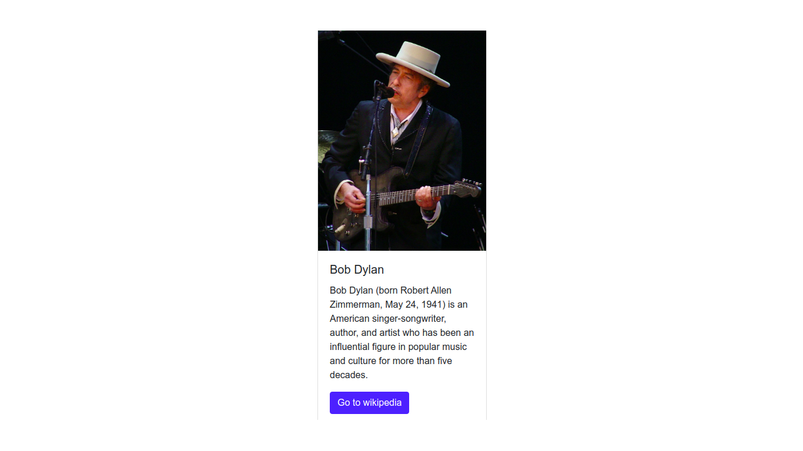

# `03` Building a layout

Let's practice a little bit more about using JSX for creating HTML.

Now we have another object that is just a bit more complex than the last one.

## Instructions:

You have a `data` object that contains Bob Dylans information (image, title, etc).

```js
const data = {
  image: "https://upload.wikimedia.org/wikipedia/commons/thumb/0/02/Bob_Dylan_-_Azkena_Rock_Festival_2010_2.jpg/800px-Bob_Dylan_-_Azkena_Rock_Festival_2010_2.jpg",
  cardTitle: "Bob Dylan",
  cardDescription: "Bob Dylan (born Robert Allen Zimmerman, May 24, 1941) is an American singer/songwriter, author, and artist who has been an influential figure in popular music and culture for more than five decades.",
  button: {
    url: "https://en.wikipedia.org/wiki/Bob_Dylan",
    label: "Go to wikipedia"
  }
};
```

Use the information contained in `data` to render a bootstrap card, for example: The card's title will be the `data.cardTitle`, etc.

Here is the HTML code for creating a card in bootstrap:

```html
<div class="card m-5" style="width: 18rem">
  
  <div class="card-body">
    <h5 class="card-title">Use the data object!</h5>
    <p class="card-text">Use the data object!</p>
    <a href="Use the data object!" class="btn btn-primary">Use the data object!</a>
  </div>
</div>
````
Source: [Bootstrap Card](https://getbootstrap.com/docs/4.0/components/card/#example)

### This is how your end result should look:

